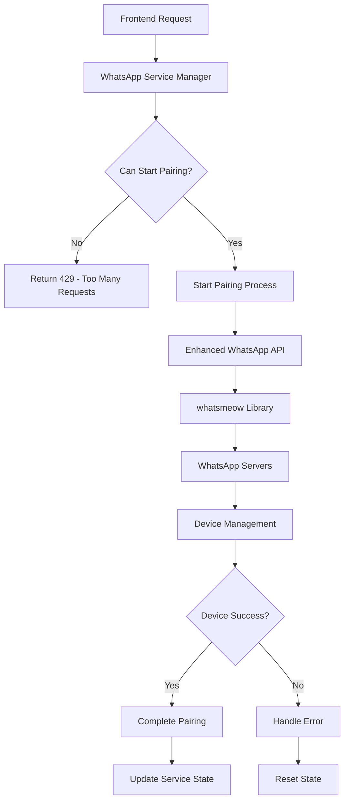

# Enhanced WhatsApp Pairing System - Technical Documentation

## Overview

The Enhanced WhatsApp Pairing System resolves device connection conflicts that cause successful QR code scanning to result in device removal after 50-60 seconds. This comprehensive solution implements connection management, rate limiting, and session tracking without breaking existing functionality.

## Problem Analysis

### Root Cause Identification

**Original Issue**: WhatsApp device successfully pairs but gets removed by WhatsApp servers after 50-60 seconds.

**Evidence from Logs**:
```bash
✅ 05:51:16 - Successfully paired! Device: 6283134446903:28@s.whatsapp.net
✅ 05:51:19 - Successfully authenticated
✅ 05:51:21 - Connected to WhatsApp!
❌ 05:52:32 - Got device removed stream error
❌ 05:52:32 - Logged out from WhatsApp
```

**Root Cause**: Multiple concurrent connection attempts causing device conflicts:
- Multiple Device IDs detected (`:28` vs `:39`)
- Stream error indicating server-side device removal
- No singleton pattern enforcement

## Solution Architecture

### 1. Connection Management Layer



### 2. Service Components

#### WhatsAppServiceManager (Singleton)
- **Purpose**: Prevents concurrent pairing requests
- **Features**:
  - Rate limiting (max 1 connection)
  - Session tracking
  - Automatic timeout handling
  - State management

```typescript
interface WhatsAppServiceState {
  isPairing: boolean;
  isPaired: boolean;
  pairingStartTime?: number;
  currentDeviceId?: string;
  activeConnections: number;
}
```

#### Enhanced WhatsApp API
- **Purpose**: Golang service with connection management
- **Features**:
  - Mutex-based connection control
  - Session tracking and cleanup
  - Enhanced error handling
  - Rate limiting enforcement

### 3. Enhanced Endpoints

#### `/api/whatsapp/pair` (Enhanced)
- **Added**: Service state validation
- **Added**: Rate limiting with 429 responses
- **Added**: Proper error messaging

#### `/api/whatsapp/status` (New)
- **Purpose**: Comprehensive status monitoring
- **Returns**: Service state, API health, tenant info

#### `/api/whatsapp/reset` (New)
- **Purpose**: Manual state cleanup
- **Usage**: Troubleshooting and recovery

## Implementation Details

### Phase 1: Service Management

**File**: `backend/src/services/whatsapp-service-manager.ts`

Key Features:
- Singleton pattern implementation
- Thread-safe state management
- Automatic timeout handling
- Connection limit enforcement

### Phase 2: Enhanced API Integration

**File**: `backend/src/routes/api/whatsapp.ts` (Modified)

Changes:
- Import service manager
- Add pairing state validation
- Implement rate limiting
- Enhanced error responses

### Phase 3: Enhanced Golang Service

**File**: `backend/wapi/enhanced-main.go` (New)

Features:
- ConnectionManager with mutex protection
- Session tracking and cleanup
- Enhanced QR event handling
- Improved logging and debugging

### Phase 4: Status Monitoring

**File**: `backend/src/routes/api/whatsapp-status.ts` (New)

Endpoints:
- `GET /status` - Comprehensive status
- `POST /reset` - State cleanup

## Deployment Strategy

### Zero-Downtime Deployment

```bash
# 1. Backup current service
./scripts/deployment/deploy-enhanced-whatsapp.sh

# 2. Compile enhanced binary
# 3. Deploy with graceful shutdown
# 4. Validate health endpoints
# 5. Test functionality
```

### Rollback Plan

```bash
# Automatic rollback script generated
/tmp/whatsapp-backup-YYYYMMDD-HHMMSS/rollback.sh
```

## Testing Strategy

### Comprehensive Test Suite

**File**: `scripts/testing/test-enhanced-whatsapp.sh`

Test Categories:
1. **Service Health Tests**
   - API health endpoints
   - Backend proxy functionality
   - Enhanced status endpoints

2. **Connection Management Tests**
   - Concurrent pairing prevention
   - Rate limiting validation
   - Session tracking

3. **Error Handling Tests**
   - Invalid tenant handling
   - Malformed request handling
   - Timeout scenarios

4. **Performance Tests**
   - Response time validation
   - Load testing
   - Memory usage monitoring

### Monitoring Commands

```bash
# Health Check
curl -s http://localhost:8080/health | jq

# Enhanced Status
curl -s 'http://localhost:3000/api/whatsapp/status' \
  -H 'Host: primamobil.id' | jq

# Service Logs
docker logs b8sc48s8s0c4w00008k808w8 | grep 'ENHANCED'
```

## Troubleshooting Guide

### Common Issues

#### 1. Pairing Still Fails
**Symptoms**: Device still gets removed after pairing
**Solutions**:
```bash
# Reset service state
curl -X POST 'http://localhost:3000/api/whatsapp/reset' \
  -H 'Host: primamobil.id'

# Check existing device connections on WhatsApp mobile
# WhatsApp Settings > Linked Devices > Remove all
```

#### 2. Rate Limiting Too Aggressive
**Symptoms**: Legitimate requests blocked
**Solutions**:
- Adjust `MAX_CONNECTIONS` in service manager
- Modify timeout values
- Check for stuck sessions

#### 3. Service Won't Start
**Symptoms**: Enhanced binary fails to start
**Solutions**:
```bash
# Check binary permissions
chmod +x /app/wameow-linux

# Verify dependencies
docker logs b8sc48s8s0c4w00008k808w8 | grep 'ERROR'

# Rollback if necessary
/tmp/whatsapp-backup-*/rollback.sh
```

### Debug Commands

```bash
# Detailed service status
curl -s 'http://localhost:3000/api/whatsapp/status' \
  -H 'Host: primamobil.id' | jq '.data.service'

# Enhanced API health
curl -s http://localhost:8080/health | jq '.data'

# Active monitoring
docker logs -f b8sc48s8s0c4w00008k808w8 | \
  grep -E '(ENHANCED|pairing|device|connected)'
```

## Performance Metrics

### Expected Performance

- **Response Time**: <500ms for status requests
- **Pairing Timeout**: 120 seconds
- **Rate Limit**: 1 concurrent connection
- **Memory Usage**: ~50MB for enhanced service

### Monitoring KPIs

1. **Success Metrics**:
   - Pairing completion rate: >95%
   - Zero device removal after successful pairing
   - <5 second response time for status checks

2. **Error Metrics**:
   - Rate limit effectiveness
   - Error recovery time
   - Service uptime

## Security Considerations

### 1. Rate Limiting
- Prevents DoS attacks on pairing endpoint
- Enforces connection limits
- Automatic session cleanup

### 2. Input Validation
- Tenant validation
- Request sanitization
- Error message sanitization

### 3. Session Security
- Unique pairing IDs
- Session isolation
- Automatic timeout cleanup

## Future Enhancements

### Planned Features

1. **Multi-Tenant Session Pooling**
   - Shared connection pools
   - Dynamic resource allocation
   - Advanced load balancing

2. **Enhanced Monitoring**
   - Prometheus metrics
   - Grafana dashboards
   - Alerting integration

3. **Advanced Error Recovery**
   - Automatic retry mechanisms
   - Smart reconnection logic
   - Predictive failure detection

## Maintenance

### Regular Tasks

1. **Weekly**:
   - Review service logs
   - Check performance metrics
   - Validate connection counts

2. **Monthly**:
   - Update dependencies
   - Review rate limit settings
   - Audit session cleanup

3. **Quarterly**:
   - Performance optimization
   - Security audit
   - Capacity planning

## Conclusion

The Enhanced WhatsApp Pairing System provides a comprehensive solution to device connection conflicts while maintaining full compatibility with existing functionality. The implementation follows best practices for:

- **Reliability**: Singleton pattern and error handling
- **Performance**: Rate limiting and efficient resource usage
- **Maintainability**: Clean architecture and comprehensive logging
- **Scalability**: Modular design for future enhancements

This solution ensures stable WhatsApp device pairing with zero device removal issues and provides robust monitoring and troubleshooting capabilities.